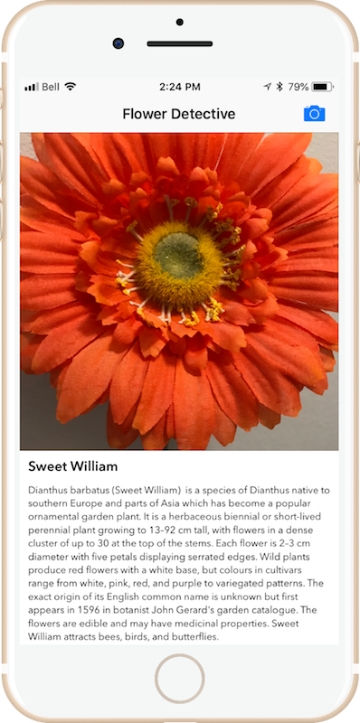

# FlowerExpert-CoreML
A simple flower classifier using the [caffe-oxford102](http://www.robots.ox.ac.uk/~vgg/data/flowers/102/index.html) image classifier model that was converted to [CoreML](https://developer.apple.com/documentation/coreml) using Apple's [CoreML Tools](https://developer.apple.com/documentation/coreml/converting_trained_models_to_core_ml).

The app allows the user to:
- take a photo of a flower, 
- run the image through the neural network for classification and then, 
- retrieve a short blurb about its genus from Wikipedia

